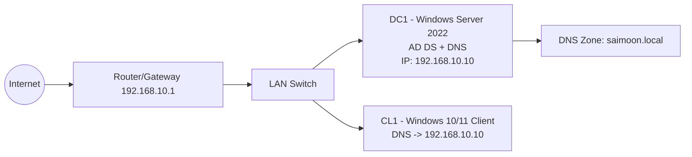

# Active Directory Domain Controller Project - saimoon.local

This project documents the full deployment of a Windows Server **2022** Active Directory Domain Services (AD\u00a0DS) Domain Controller for the domain **saimoon.local**, including verification steps, required screenshots and diagrams.  The repository is organized so that you can reproduce the lab, capture evidence and upload everything to GitHub.

## Project Goals

- Configure a Windows\u00a0Server\u00a02022 machine as a Domain Controller.
- Create and verify the domain: **saimoon.local**.
- Verify AD\u00a0DS, DNS and replication/service health.
- Join a Windows client to the domain.
- Create users, OUs, groups and apply a sample Group Policy Object (GPO).
- Provide proof via screenshots and command outputs.

## Lab Topology

| Role | Hostname | OS | Function |
| --- | --- | --- | --- |
| Domain Controller | **DC1** | Windows\u00a0Server\u00a02022 | AD\u00a0DS + DNS | 
| Client | **CL1** | Windows\u00a010/11 | Domain\u2011joined client |

## Documentation

All documentation is stored under the `docs/` directory:

- **Main Report:** [`docs/01-Project-Report.md`](docs/01-Project-Report.md) \u2014 detailed step\u2011by\u2011step instructions to build the lab.
- **Screenshot Checklist:** [`docs/02-Screenshots-Checklist.md`](docs/02-Screenshots-Checklist.md) \u2014 a list of evidence required at each step.
- **Verification Commands:** [`docs/03-Verification-Commands.md`](docs/03-Verification-Commands.md) \u2014 commands to confirm the health of the domain and services.
- **Troubleshooting:** [`docs/04-Troubleshooting.md`](docs/04-Troubleshooting.md) \u2014 common problems and solutions.
- **Diagrams:** [`docs/diagrams/`](docs/diagrams/) \u2014 Mermaid diagrams for network, logical AD and GPO flow.

## Scripts

The `scripts/` folder contains helper PowerShell scripts to speed up deployment and verification:

- [`scripts/dc-install.ps1`](scripts/dc-install.ps1) \u2014 installs the AD\u00a0DS role and creates the **saimoon.local** forest.
- [`scripts/verification.ps1`](scripts/verification.ps1) \u2014 runs common health checks on the Domain Controller.
- [`scripts/client-join.ps1`](scripts/client-join.ps1) \u2014 joins a Windows client to the domain.

## How to Use

1. Read and follow the step\u2011by\u2011step instructions in [`docs/01-Project-Report.md`](docs/01-Project-Report.md).  Customize IP addresses and names to match your lab.
2. Capture the screenshots listed in [`docs/02-Screenshots-Checklist.md`](docs/02-Screenshots-Checklist.md) and save them into the `screenshots/` folder.
3. Run the verification scripts and copy their outputs into the report to show the domain is healthy.
4. Commit all files (report, scripts, screenshots and diagrams) and push them to your GitHub repository.

## Author

Saimoon\u00a0Islam

## Screenshots and Diagrams

Below is a conceptual network diagram to help visualise the environment for this project.  GitHub renders Mermaid diagrams automatically, so the diagram will appear when viewing the README on GitHub.  Feel free to add your own screenshots from the deployment (e.g. server settings, user creation, GPO application) into the `screenshots/` folder and embed them here using Markdown.

